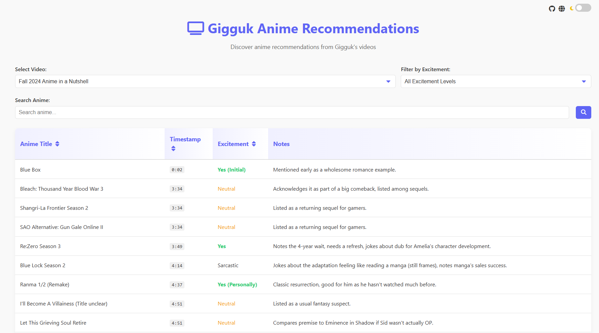

# Gigguk Anime Recommendations

[](https://opensource.org/licenses/MIT)

A modern web application that organizes and displays anime recommendations from Gigguk's "Anime in a Nutshell" YouTube videos. This tool extracts, processes, and presents anime titles mentioned by Gigguk along with his enthusiasm level and comments about each show.



## 🌟 Features

- **📊 Interactive Web Interface**: Search, filter, and sort anime recommendations
- **🎬 Video Selection**: Choose from multiple Gigguk videos
- **🔍 Search Functionality**: Find specific anime titles or keywords
- **📱 Responsive Design**: Works on desktop and mobile devices
- **🌓 Dark Mode**: Toggle between light and dark themes
- **🔄 Dynamic Loading**: CSV data loads on demand

## 📋 Contents

- [Demo](#demo)
- [Technologies](#technologies)
- [Setup and Installation](#setup-and-installation)
- [Usage](#usage)
  - [Web Interface](#web-interface)
  - [Extracting New Anime References](#extracting-new-anime-references)
- [Project Structure](#project-structure)
- [Contributing](#contributing)
- [License](#license)
- [Credits](#credits)

## 🌐 Demo

You can view a live demo of the application here: [Live Demo](http://portfolio.ashutoshmishra.dev/gigguk-recommendations/) 

## 💻 Technologies

### Frontend
- HTML5/CSS3
- JavaScript (Vanilla)
- Font Awesome for icons

### Backend
- Python 3.10+
- [youtube-transcript-api](https://github.com/jdepoix/youtube-transcript-api)
- [yt-dlp](https://github.com/yt-dlp/yt-dlp)
- [google-generativeai](https://github.com/google/generative-ai-python) (for Gemini API)

## 🔧 Setup and Installation

### Prerequisites
- Python 3.10 or higher
- Google Gemini API key (for extracting new anime references)

### Installation Steps

1. Clone the repository:
   ```bash
   git clone https://github.com/ASH1998/gigguk-recommendations.git
   cd gigguk-recommendations
   ```

2. Install the required Python packages:
   ```bash
   pip install -r requirements.txt
   ```

3. Set up your Gemini API key (only required for extracting new data):
   - Copy the `.env.example` file to `.env`
   - Add your Gemini API key to the `.env` file:
     ```
     GEMINI_API_KEY=your_api_key_here
     ```

4. Start a local server:
   ```bash
   python -m http.server 8000
   ```

5. Open your browser and navigate to:
   ```
   http://localhost:8000
   ```

## 🚀 Usage

### Web Interface

1. **Select a Video**: Choose one of Gigguk's "Anime in a Nutshell" videos from the dropdown menu
2. **Filter by Excitement**: Filter anime by Gigguk's enthusiasm level
3. **Search**: Enter keywords to search for specific anime titles or notes
4. **Sort**: Click on column headers to sort the table
5. **Dark Mode**: Toggle the theme switch in the top-right corner

### Extracting New Anime References

To extract anime references from a new Gigguk video:

1. Ensure you have set up your Gemini API key in the `.env` file

2. Run the extraction script with the YouTube video ID:
   ```bash
   python anime_extractor.py
   ```

3. For custom usage, you can modify the `video_id` in the script:
   ```python
   # In anime_extractor.py
   video_id = "YOUR_VIDEO_ID_HERE"
   ```

4. The script will:
   - Download the video transcript
   - Extract timestamps from the video description
   - Use Google's Gemini model to identify anime references
   - Save the data as CSV in the `transcripts` folder
   - Update the `csv_config.json` file with the new CSV entry

## 📂 Project Structure

```
gigguk-recommendations/
│
├── index.html            # Main HTML file for the web interface
├── styles.css            # CSS styles for the web interface
├── script.js             # JavaScript for the web application
│
├── anime_extractor.py    # Main script for extracting anime references
├── youtube_transcript_downloader.py # YouTube data extraction utilities
├── example.py            # Example usage of the transcript downloader
├── info.py               # Simple script to get YouTube video description
│
├── csv_config.json       # Configuration file for available CSV files
├── requirements.txt      # Python dependencies
├── .env.example          # Example environment variables file
│
└── transcripts/          # Directory for CSV files with anime references
    ├── Fall 2024 Anime in a Nutshell_anime_references.csv
    └── Spring Anime 2025 In A Nutshell_anime_references.csv
```

## 🤝 Contributing

Contributions are welcome! If you'd like to contribute:

1. Fork the repository
2. Create a new branch (`git checkout -b feature/your-feature`)
3. Make your changes
4. Commit your changes (`git commit -m 'Add your feature'`)
5. Push to the branch (`git push origin feature/your-feature`)
6. Open a Pull Request

## 📜 License

This project is licensed under the MIT License - see the [LICENSE](LICENSE) file for details.

## 🙏 Credits

- [Gigguk](https://www.youtube.com/@gigguk) for the entertaining anime reviews
- [Ashutosh Mishra](https://www.ashutoshmishra.dev/) for developing this project
- [Font Awesome](https://fontawesome.com/) for the icons
- [Google Gemini API](https://ai.google.dev/docs/gemini_api_overview) for AI-powered data extraction

---

### 📌 Links

- [GitHub Repository](https://github.com/ASH1998/gigguk-recommendations)
- [Contributor's Website](https://www.ashutoshmishra.dev/)
- [Gigguk's YouTube Channel](https://www.youtube.com/@gigguk)
- [Gigguk's Anime in a Nutshell Playlist](https://www.youtube.com/playlist?list=PLoVmS_yfgM6pF6T-_yMHKvm2vDN0CIVqG)